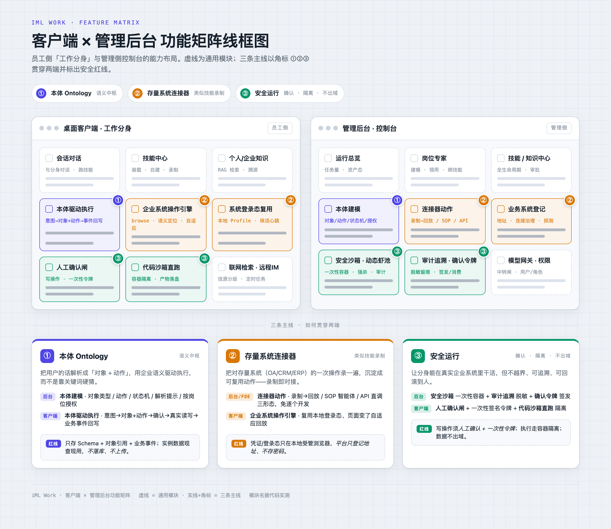
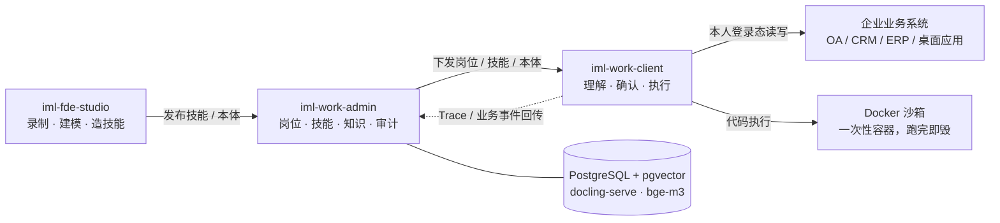
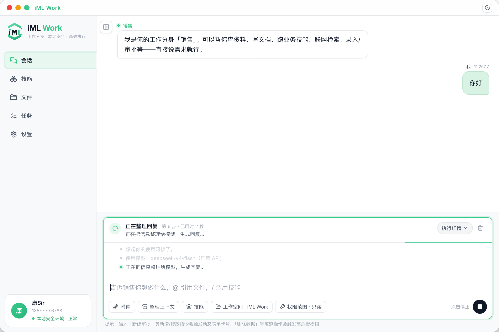
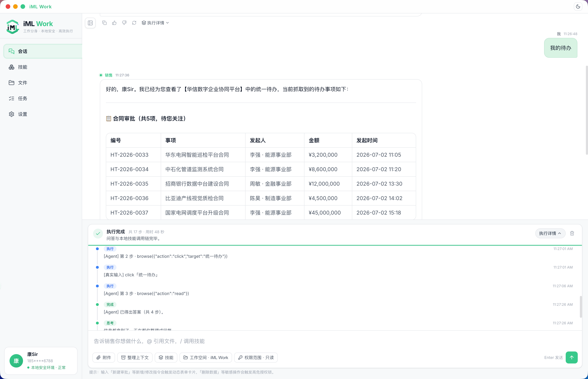
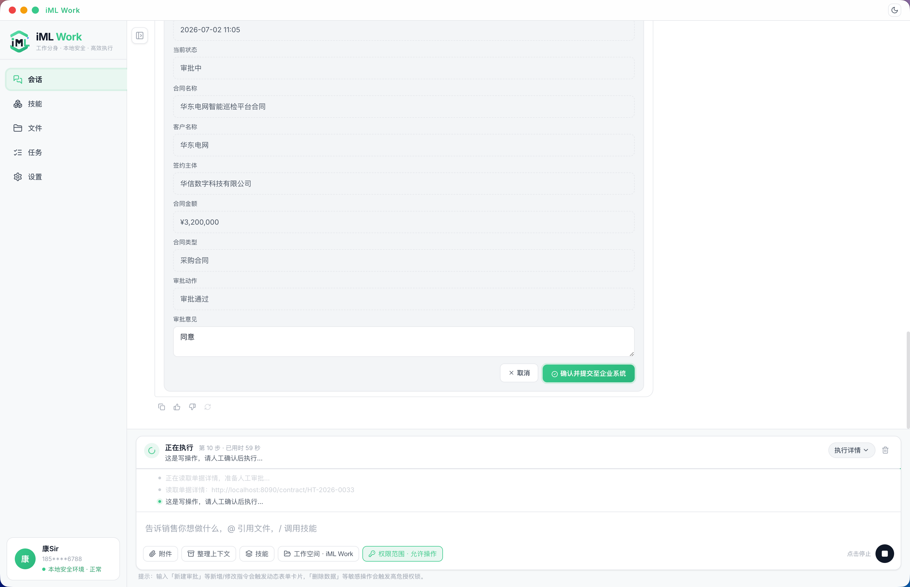
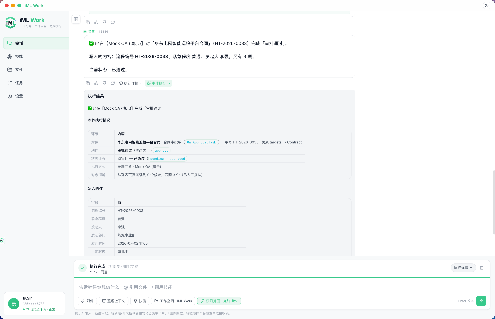
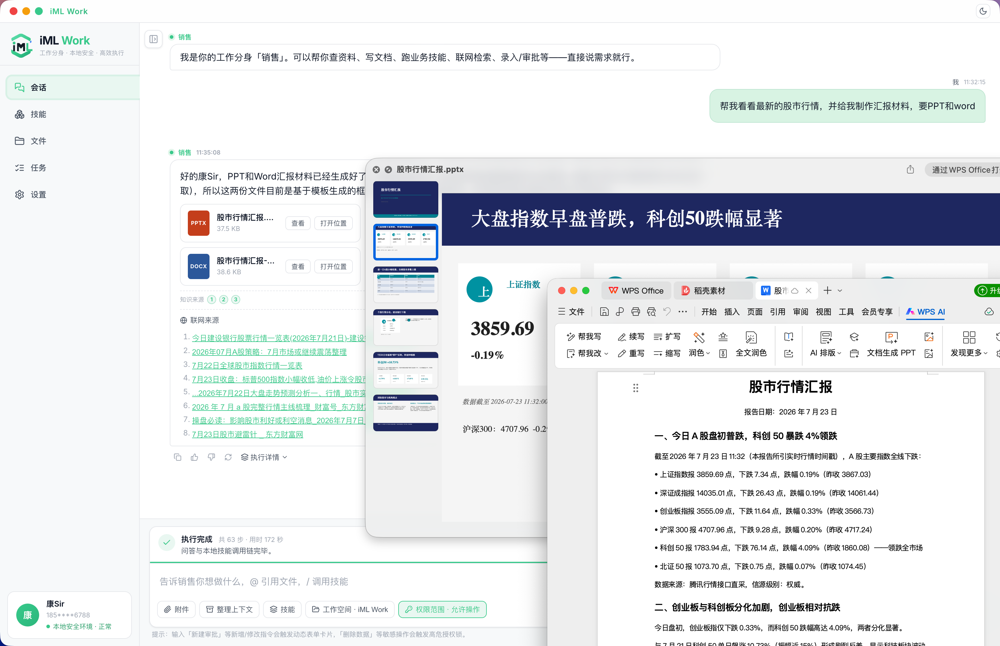
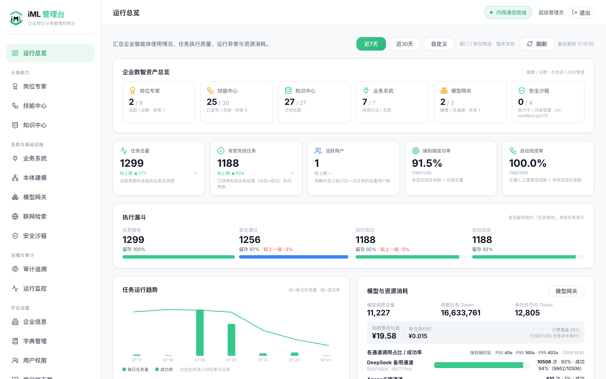
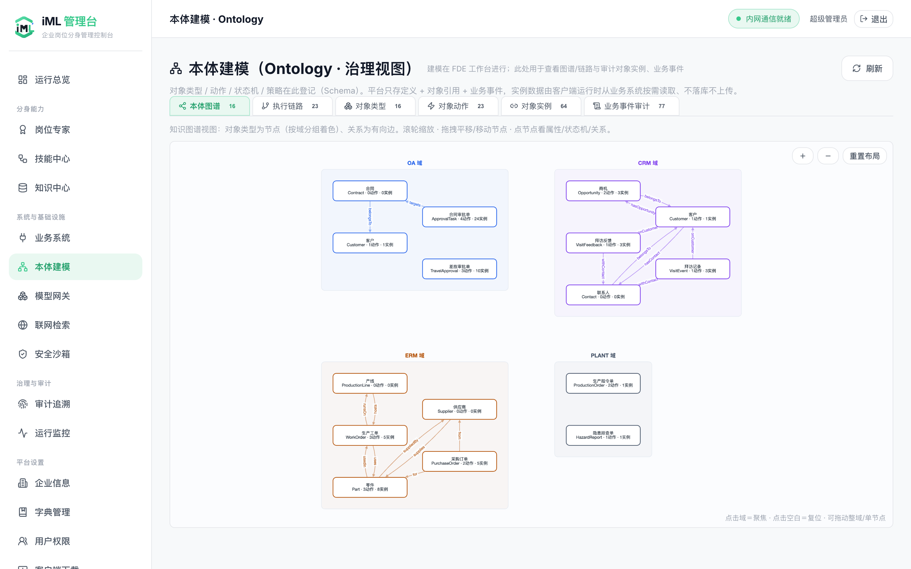
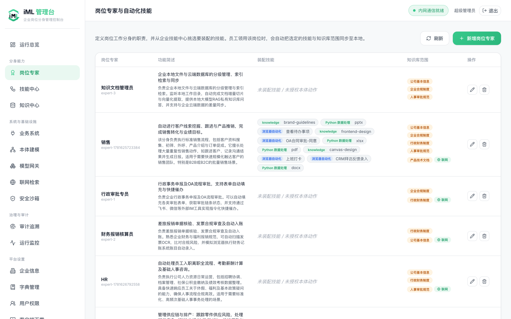

<h1 align="center">iML Work</h1>

<p align="center">企业「工作分身」系统 —— 员工电脑上跑一个能在真实 OA / CRM / ERP 里<strong>真正动手</strong>的 AI 分身。</p>

<p align="center">
  <a href="LICENSE"></a>
  
  
  
  
  
  
</p>

<p align="center">
  <picture>
    <source media="(prefers-color-scheme: dark)" srcset="assets/feature-matrix-dark.png">
    
  </picture>
</p>

读 OA 待办、审批流转、查 CRM 客户、写周报、生成 Word/PPT。写操作动手前先请示，凭证从不离开员工本机。

系统分四个端，外加一层四端共用的业务语义模型：

| 目录 | 职责 | 技术栈 |
|---|---|---|
| `iml-work-client` | 员工桌面客户端，分身本体 | Electron + React + better-sqlite3 |
| `iml-work-admin/admin-backend` | 管理后端：岗位、技能、本体、知识库、审计 | Java 21 / Spring Boot 3.3 / PostgreSQL 17 + pgvector |
| `iml-work-admin/admin-frontend` | 管理前端 | React + TypeScript + Vite |
| `iml-fde-studio` | FDE 工作台：接系统、建模、造技能 | Electron + React |
| `iml-mock-oa` | 演示用 Mock OA / CRM / ERM | Node（一进程起 8090/8091/8092） |

分工一句话说完：管理平台定义，客户端执行，FDE 工作台构建。



## 三条主线

普通 AI 工具停在「聊天」，iML Work 的分身能在真实企业系统里动手。靠的是三件事（对应上图底部三张卡）：

### 本体 Ontology · 业务语义层

把用户的话解析成「对象 + 动作」，用企业语义驱动执行，而不是靠关键词硬猜。一个业务名词不再是孤立的词，而是接入它的关联对象与上下游链路，按企业流程推理执行。

> **红线**：只存 Schema + 对象引用 + 业务事件；实例数据现查现用，不落库、不上传。

### 存量系统连接器 · 类似技能录制

把对存量系统（OA / CRM / ERP）的一次操作录一遍，沉淀成可复用动作，录制即对接。核心是 browse-use：没有 API 也能无侵入接入，员工在对话框里就能跨多个系统连续操作，页面小改也能自适应回放。

> **红线**：凭证 / 登录态只在本地受管浏览器，平台只登记地址、不存密码。

### 安全运行 · 确认 · 隔离 · 不出域

写操作一律过闸：确认卡列明系统、真实对象、动作、字段，人工点头后签发一次性令牌，只对这一笔有效。代码执行送进一次性容器（跑完即毁、默认断网、限 CPU/内存），拿不到凭证也看不到宿主。

> **红线**：读不到的对象绝不虚构，单号、金额、人名一个都不编。

## 界面一览

真实运行截图（演示数据 · Mock OA）。

### 员工客户端 · 工作分身

一条真实工作流：对话下需求 → 分身进 OA 读待办 → 写操作人工确认 → 本体驱动执行 → 联网生成交付物。

**① 与分身对话** —— 领用「销售」岗位分身，自然语言说需求即可



**② 读存量系统** —— 分身 browse 进企业 OA，点开「统一待办」读出合同审批列表，执行轨迹逐步可查



**③ 写操作确认闸** —— 敏感写操作前弹出确认卡，人工点「确认并提交至企业系统」才落笔



**④ 本体驱动执行** —— 消解成 `OA.ApprovalTask.approve`，状态机 `pending → approved`，对象消解与写入值全程留痕



**⑤ 生成交付物** —— 联网检索 + 行情直采，一句话产出 PPT / Word 汇报材料



### 管理后台 · 控制台

**运行总览** —— 企业数智资产、任务执行质量、模型与资源消耗一屏尽览



**本体建模 · 业务语义层** —— 对象 / 动作 / 状态机 / 关系，四端共用的企业知识图谱（OA / CRM / ERM / 生产域）



**岗位专家** —— 定义岗位分身职责，从技能中心装配浏览器自动化 / 代码 / 知识技能



## 跑起来

开发环境一条命令，依次拉起 PostgreSQL、后端(:8080)、管理前端(:3000)、Mock OA：

```bash
bash scripts/dev.sh
```

桌面端各自启动：

```bash
cd iml-work-client && npm run dev     # 员工客户端
cd iml-fde-studio  && npm run dev     # FDE 工作台
```

沙箱、docling 文档解析、bge-m3 向量模型跑在 Docker 上，也是一条命令：

```bash
bash scripts/docker-services.sh up
```

有个坑值得单独提醒：向量模型缺失时系统**不报错**，检索会静默退化成字面匹配、知识库形同虚设——部署时务必先核验它就绪。

## 设计要点

### 业务本体是地基

对象、属性、状态机、动作、事件，建模一次四端共用。「审批宝钢合同」不靠关键词硬猜，而是消解成 `ApprovalTask.approve` 加一个真实读到的对象。金额、风险阈值这类策略挂在对象状态上。平台只存 Schema 和对象引用，实例数据现查现用，不落库。

### 执行分两个互不接触的平面

本地可信平面在员工本机：用本人登录态操作 OA/CRM/ERP 和桌面应用，浏览器登录态按系统隔离分区，有心跳保活。凭证和业务数据只在这一面。

集中沙箱平面在公司级 Docker：代码执行型技能送进一次性容器，跑完即毁，默认断网，限 CPU/内存/超时，有并发闸。容器拿不到凭证，也看不到宿主文件。不可信代码永远不在员工机器上跑。

技能本身只含步骤和脚本。平台登记业务系统只记地址和可达状态，不收密码。

### 分身怎么听懂人话

路由分层，命中即走：本体消解 → 关键词快路径 → 模型意图路由（一次可选多个技能，比如"要 Word 报告和 PPT"）。都不中就退回问答，且只根据真实读到的内容作答。

写操作一律过闸。确认卡列明系统、真实对象、动作、字段，人工点头后签发一次性令牌，只对这一笔有效。读不到的对象绝不虚构，查不出来就降级人工指认，单号、金额、人名一个都不编。

### 技能从录制来，但不是录制回放

FDE 录制只做示范采集，落库的是语义脚本 DSL 加 SOP，按 label、可见文本、角色定位元素，不是坐标和 nth-of-type。页面小改不至于技能报废。捕获面覆盖 shadow DOM、富文本、radio/checkbox 组、文件上传、回车提交，门户点开新窗口、表单嵌 iframe 也照录照放。

录制值不焊死：录完自动识别哪些值是业务数据（点了列表行、检索选择、日期金额单号形态），出建议由作者逐项采纳成 `{{参数}}`——参数能注入到填写值，也能注入到"点谁"。录不稳的交互降级成一条 AI 指令步（每技能最多 3 步），回放时模型现场只完成那一步。上架前可以「安全试回放」：写入动作只验证定位不落笔，走到提交步自动停；试跑中智能体自愈成功的定位会固化回技能，下次回放不再花模型钱。

Agentic 技能包（SKILL.md + scripts）从仓库整目录安装，执行时模型读手册现场写 Python，送沙箱跑，失败把 stderr 喂回去自修复重试。

### 知识库

服务端 RAG 链路：docling 解析文档（表格、版面、OCR 扫描件）→ 切块 → bge-m3 算 1024 维向量 → pgvector 检索。相关性阈值按 bge-m3 实测标定过，换向量模型要改维度、重建全部向量（`POST /api/v1/knowledge/reindex`）并重新标定阈值，缺一步检索质量就崩。

员工本机另有一套完全离线的个人记忆：SQLite 按账号分库，ONNX 本地向量化，敏感语料不出网。个人文档可以提名进企业库，走审批。

### 审计

AgentTrace 记全链路：谁、问了什么、路由到哪个技能、每个 span 干了什么、风险等级、最终状态，管理端驾驶舱可逐条下钻。审计文本导出带分级脱敏。登录成功失败都记。

## 智能化水平

这条手搓的智能体管线不是黑箱——我们用主流公开测试集量化过它的水平，harness 和题库都在 [`iml-work-client/bench/`](iml-work-client/bench/)，`npm run eval:bench` 一键可复跑。最能说明问题的，是**同题、同模型（DeepSeek）、同判分口径，唯一变量是有没有 iML Work 管线**的对照——精准且诚实地画出了 iML Work 的价值边界：

| 测试集 | 考察 | 裸 DeepSeek<br>（没 iML Work） | **iML Work**<br>（有） | 增量 |
|---|---|---|---|---|
| **SimpleQA** | 英文长尾事实 | 30.0% | **66.7%** | **+36.7** 🚀 |
| **C-SimpleQA** | 中文事实 | 76.7% | **90.0%** | +13.3 |
| **FRAMES** | 多跳检索 | 40.0% | **60.0%** | **+20.0** 🚀 |
| **GAIA** | 文本/工具题 | 25.0% | 25.0% | 0 |
| **GSM8K** | 数学推理 | 100.0% | 96.7% | −3.3 |
| **IFEval** | 指令/格式遵循 | 85.0% | **90.0%** | +5.0 |

**这张表精准且诚实地画出 iML Work 的价值边界**：需要"外部能力"的题大幅加分——联网检索让 SimpleQA **+36.7**、FRAMES +20、C-SimpleQA +13.3，格式校验让 IFEval +5；纯模型推理的题（GSM8K）裸 DeepSeek 本身已 100%，管线不加分甚至略减——**这点照实写，不吹**；GAIA 打平，卡在多模态工具广度。FRAMES 把 DeepSeek 从"单趟 naive"（40%）提到多步检索（60%），是这套管线最实在的增量。

几个数字背后的东西：

- **不编造是有实测支撑的产品主张**。同样的题，接上真实性红线后错答率相对裸模型直接减半（中文 27%→13%、英文 57%→23%）——分身宁可如实说"没查到"，也绝不给你编一个单号金额人名。这正是企业场景敢把它放进审批流的底气。
- **中文事实能力是真的强**。C-SimpleQA 90% 高于所有公开榜成绩，员工问公司制度、行业常识、业务事实，答得住。
- **该联网时联网、该本地算时本地算**。检索链一旦触发，多跳补查、信源分级、日期纪律全程在线；而自足的计算题直接本地算不瞎联网，中位时延还砍掉四成。
- **稳**。150 道题连跑，0 超时、0 崩溃，每一次任务全链路 Trace 落库可回放。

完整对照含裸 DeepSeek 基线、**企业系统自主操作 pass rate 3/3** 与逐题判分；harness 与题库随仓开放，`npm run eval:bench` 可复跑。

> **说句实在话**：这些数字只能说明这条路走得通，离大厂专业团队的投入和打磨还差得远。这个开源项目更像是一次工程思路的探索——把「本体语义 + 存量系统连接 + 安全执行」这条路完整跑通给你看。真要在企业里正式建设、规模化落地，还是得靠专业团队来做工程和交付。

## 生产部署

后端打包成可执行 jar，配置放 jar 外面，改配置不用重新打包：

```bash
bash scripts/package-backend.sh    # 产出 dist/backend/
```

没有外网的 Linux 服务器走离线方案：镜像（pgvector、ollama+bge-m3、docling、沙箱）在有网机器上 save 成 tar，拷过去 load，全容器化拉起。步骤见 [`admin-backend/deploy/DEPLOY-offline-linux.md`](iml-work-admin/admin-backend/deploy/DEPLOY-offline-linux.md)（打包后复制到 `dist/backend/`）。有一个容易栽的地方：镜像 tar 分架构，arm64 的包放到 x86_64 服务器上会直接 `exec format error`，备制品前先在目标机跑一下 `uname -m`。

prod 配置下 JWT 密钥、HMAC 密钥、初始管理员口令缺失或太弱，后端拒绝启动，这是故意的。

## 技术选型

选型就三条硬约束：**能全私有离线部署**（政企内网）、**国产算力上能跑**（信创）、**凭证与数据不出内网**（本地优先）。所以能自托管的一律自托管，模型用开源满血版。

| 层 | 用了什么 | 为什么这么选 |
|---|---|---|
| 后端 | [Java 21](https://openjdk.org/projects/jdk/21/) · [Spring Boot 3.3](https://spring.io/projects/spring-boot) | 政企运维熟这套栈，私有化交付省心 |
| 数据 + 检索 | [PostgreSQL 17](https://www.postgresql.org/) + [pgvector](https://github.com/pgvector/pgvector) | 一个库同时装关系数据和向量，少一个中间件 |
| 迁移 · 鉴权 · 文档 | [Flyway](https://github.com/flyway/flyway) · [jjwt](https://github.com/jwtk/jjwt) · [springdoc-openapi](https://github.com/springdoc/springdoc-openapi) | schema 版本化、JWT 鉴权、OpenAPI 自动出文档 |
| 沙箱 | [Docker](https://www.docker.com/) via [docker-java](https://github.com/docker-java/docker-java) | 一次性容器隔离，不可信代码永不落员工机 |
| 前端 | [React 18](https://react.dev/) · [TypeScript](https://www.typescriptlang.org/) · [Vite](https://vite.dev/) · [Cytoscape.js](https://js.cytoscape.org/) | 本体图谱用 Cytoscape 画 |
| 桌面端 | [Electron 30](https://www.electronjs.org/) + [better-sqlite3](https://github.com/WiseLibs/better-sqlite3) | 客户端要坐到员工工位、按账号本地分库 |
| 浏览器自动化 | [Playwright](https://playwright.dev/) | 语义定位、跨 iframe、有头无头都行 |
| 桌面自动化 | [nut.js](https://github.com/nut-tree/nut.js) + [uiohook-napi](https://github.com/SnosMe/uiohook-napi) | 非浏览器的桌面系统，也能录制与回放 |
| 文档解析 | [Docling](https://github.com/docling-project/docling) | 表格、版面、OCR 扫描件都能拆 |
| 向量模型 | [bge-m3](https://huggingface.co/BAAI/bge-m3) via [Ollama](https://ollama.com/) | 1024 维、中文强，可私有部署 |
| 联网检索 | [SearXNG](https://github.com/searxng/searxng) | 自托管元搜索，终端不裸连厂商 |
| 大模型 | [DeepSeek](https://github.com/deepseek-ai) · [通义千问](https://github.com/QwenLM/Qwen) | 开源满血版，昇腾等国产算力单机可跑 |

远程通道用飞书 / 钉钉 / QQ 官方 SDK（[oapi-sdk-nodejs](https://github.com/larksuite/oapi-sdk-nodejs) 等）；技能包沿用 Anthropic 的 [SKILL.md](https://github.com/anthropics/skills) 约定；另用到 [lucide](https://lucide.dev/)（图标）、[zustand](https://github.com/pmndrs/zustand)（状态）、[pdf.js](https://mozilla.github.io/pdf.js/)（本地兜底解析）。

**站在这些开源项目肩膀上，一并致谢。**

## 交流与支持

开源出来的是思路和实现。想在真实企业里稳定落地，欢迎聊聊：

- 加微信（备注 **iML Work**）：有专业团队做更稳定的企业版本和落地交付。
- 关注公众号「AI产品康Sir」：更多 AI 产品设计与实践。

<p></p>

## License

[MIT](LICENSE)
