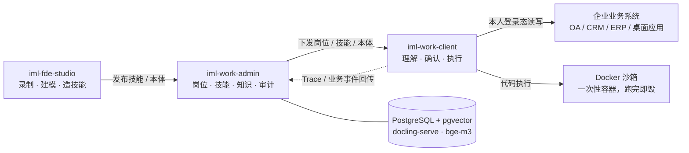

# iML Work

企业「工作分身」系统。员工电脑上跑一个能真正动手的 AI 分身：读 OA 待办、审批流转、查 CRM 客户、写周报、生成 Word/PPT。写操作动手前先请示，凭证从不离开员工本机。

系统分四个端，外加一层四端共用的业务语义模型：

| 目录 | 职责 | 技术栈 |
|---|---|---|
| `iml-work-client` | 员工桌面客户端，分身本体 | Electron + React + better-sqlite3 |
| `iml-work-admin/admin-backend` | 管理后端：岗位、技能、本体、知识库、审计 | Java 21 / Spring Boot 3.3 / PostgreSQL 17 + pgvector |
| `iml-work-admin/admin-frontend` | 管理前端 | React + TypeScript + Vite |
| `iml-fde-studio` | FDE 工作台：接系统、建模、造技能 | Electron + React |
| `iml-mock-oa` | 演示用 Mock OA / CRM / ERM | Node（一进程起 8090/8091/8092） |

分工一句话说完：管理平台定义，客户端执行，FDE 工作台构建。



## 跑起来

开发环境一条命令，依次拉起 PostgreSQL、后端(:8080)、管理前端(:3000)、Mock OA：

```bash
bash scripts/dev.sh
```

桌面端各自启动：

```bash
cd iml-work-client && npm run dev     # 员工客户端
cd iml-fde-studio  && npm run dev     # FDE 工作台
```

沙箱、docling 文档解析、bge-m3 向量模型跑在 Docker 上，也是一条命令：

```bash
bash scripts/docker-services.sh up
```

完整启动手册在 [RUNBOOK.md](RUNBOOK.md)，含健康检查命令和已知的坑。其中向量模型值得单独提醒：它缺失时系统不报错，检索会静默退化成字面匹配，知识库形同虚设，所以 RUNBOOK 把它列为准必需并给了核验命令。

## 设计要点

### 业务本体是地基

对象、属性、状态机、动作、事件，建模一次四端共用。「审批宝钢合同」不靠关键词硬猜，而是消解成 `ApprovalTask.approve` 加一个真实读到的对象。金额、风险阈值这类策略挂在对象状态上。平台只存 Schema 和对象引用，实例数据现查现用，不落库。

### 执行分两个互不接触的平面

本地可信平面在员工本机：用本人登录态操作 OA/CRM/ERP 和桌面应用，浏览器登录态按系统隔离分区，有心跳保活。凭证和业务数据只在这一面。

集中沙箱平面在公司级 Docker：代码执行型技能送进一次性容器，跑完即毁，默认断网，限 CPU/内存/超时，有并发闸。容器拿不到凭证，也看不到宿主文件。不可信代码永远不在员工机器上跑。

技能本身只含步骤和脚本。平台登记业务系统只记地址和可达状态，不收密码。

### 分身怎么听懂人话

路由分层，命中即走：本体消解 → 关键词快路径 → 模型意图路由（一次可选多个技能，比如"要 Word 报告和 PPT"）。都不中就退回问答，且只根据真实读到的内容作答。

写操作一律过闸。确认卡列明系统、真实对象、动作、字段，人工点头后签发一次性令牌，只对这一笔有效。读不到的对象绝不虚构，查不出来就降级人工指认，单号、金额、人名一个都不编。

### 技能从录制来，但不是录制回放

FDE 录制只做示范采集，落库的是语义脚本 DSL 加 SOP，按 label、可见文本、角色定位元素，不是坐标和 nth-of-type。页面小改不至于技能报废。录完自动生成 SOP、触发词和参数确认表单，在工作台发一段话就能真跑整条链路验证，通过再上架。

Agentic 技能包（SKILL.md + scripts）从仓库整目录安装，执行时模型读手册现场写 Python，送沙箱跑，失败把 stderr 喂回去自修复重试。

### 知识库

服务端 RAG 链路：docling 解析文档（表格、版面、OCR 扫描件）→ 切块 → bge-m3 算 1024 维向量 → pgvector 检索。相关性阈值按 bge-m3 实测标定过，换向量模型要改维度、重建全部向量（`POST /api/v1/knowledge/reindex`）并重新标定阈值，缺一步检索质量就崩。

员工本机另有一套完全离线的个人记忆：SQLite 按账号分库，ONNX 本地向量化，敏感语料不出网。个人文档可以提名进企业库，走审批。

### 审计

AgentTrace 记全链路：谁、问了什么、路由到哪个技能、每个 span 干了什么、风险等级、最终状态，管理端驾驶舱可逐条下钻。审计文本导出带分级脱敏。登录成功失败都记。

## 生产部署

后端打包成可执行 jar，配置放 jar 外面，改配置不用重新打包：

```bash
bash scripts/package-backend.sh    # 产出 dist/backend/
```

没有外网的 Linux 服务器走离线方案：镜像（pgvector、ollama+bge-m3、docling、沙箱）在有网机器上 save 成 tar，拷过去 load，全容器化拉起。步骤在 `dist/backend/DEPLOY-offline-linux.md`。有一个容易栽的地方：镜像 tar 分架构，arm64 的包放到 x86_64 服务器上会直接 `exec format error`，备制品前先在目标机跑一下 `uname -m`。

prod 配置下 JWT 密钥、HMAC 密钥、初始管理员口令缺失或太弱，后端拒绝启动，这是故意的。

## License

[MIT](LICENSE)
