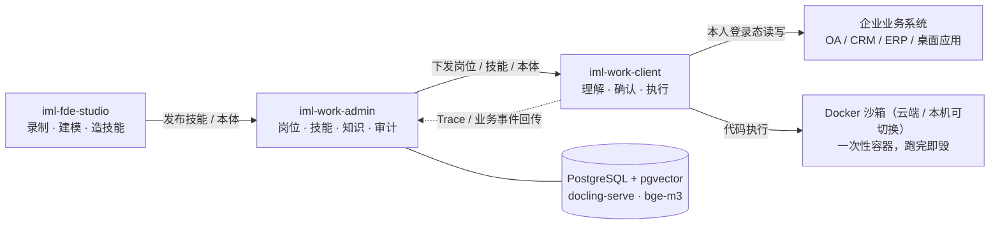
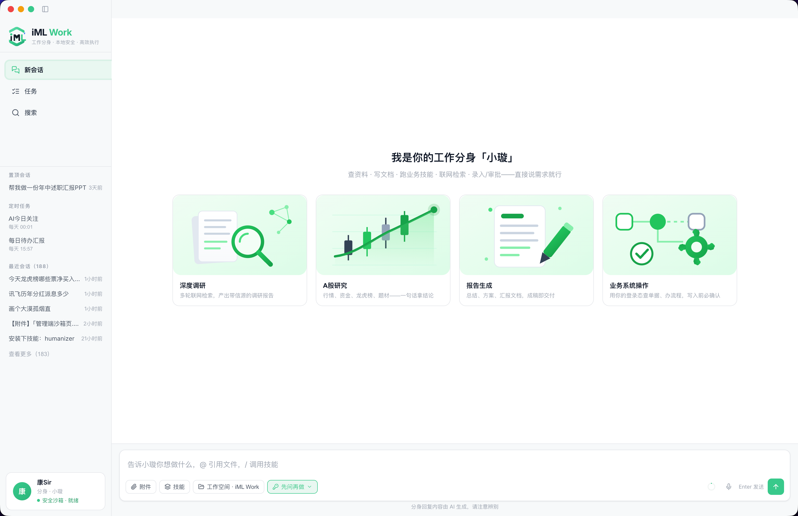
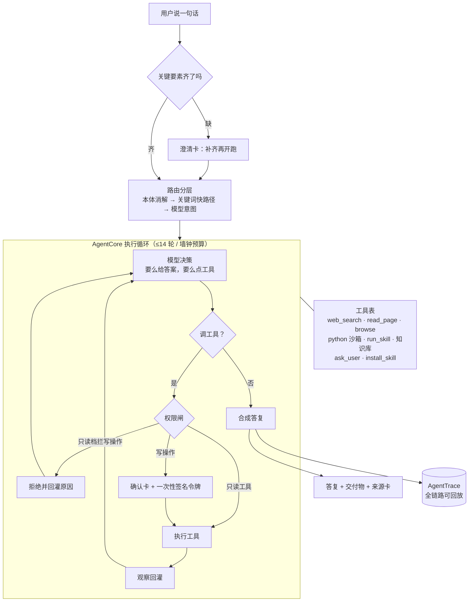
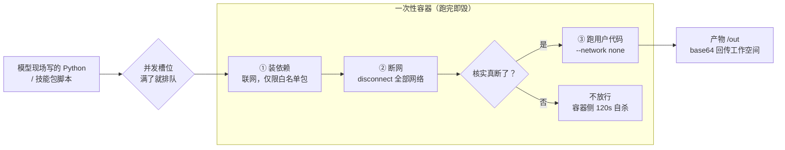

<p align="center">
  
</p>

<h1 align="center">iML Work</h1>

<p align="center">企业「工作分身」系统 —— 员工电脑上跑一个能在真实 OA / CRM / ERP 里<strong>真正动手</strong>的 AI 分身。</p>

<p align="center">
  <a href="LICENSE"></a>
  
  
  
  
  
  
</p>

<p align="center">在线体验：<a href="http://imlwork.imlstudio.cn">imlwork.imlstudio.cn</a></p>

读 OA 待办、审批流转、查 CRM 客户、写周报、生成 Word/PPT。写操作动手前先请示，凭证从不离开员工本机。

系统分四个端，外加一层四端共用的业务语义模型：

| 目录 | 职责 | 技术栈 |
|---|---|---|
| `iml-work-client` | 员工客户端，分身本体（桌面 / 浏览器双形态） | Electron + React + better-sqlite3 |
| `iml-work-admin/admin-backend` | 管理后端：岗位、技能、本体、知识库、审计 | Java 21 / Spring Boot 3.3 / PostgreSQL 17 + pgvector |
| `iml-work-admin/admin-frontend` | 管理前端 | React + TypeScript + Vite |
| `iml-fde-studio` | FDE 工作台：接系统、建模、造技能 | Electron + React |
| `iml-mock-oa` | 演示用 Mock OA / CRM / ERM | Node（一进程起 8090/8091/8092） |

分工：管理平台定义，客户端执行，FDE 工作台构建。


```mermaid
flowchart LR
    FDE["iml-fde-studio<br/>录制 · 建模 · 造技能"] -->|发布技能 / 本体| ADMIN["iml-work-admin<br/>岗位 · 技能 · 知识 · 审计"]
    ADMIN -->|下发岗位 / 技能 / 本体| CLIENT["iml-work-client<br/>理解 · 确认 · 执行"]
    CLIENT -.->|Trace / 业务事件回传| ADMIN
    CLIENT -->|本人登录态读写| BIZ["企业业务系统<br/>OA / CRM / ERP / 桌面应用"]
    CLIENT -->|代码执行| BOX["Docker 沙箱（云端 / 本机可切换）<br/>一次性容器，跑完即毁"]
    ADMIN --- INFRA[("PostgreSQL + pgvector<br/>docling-serve · bge-m3")]
```

## 功能清单

三条底线贯穿所有功能：凭证与业务实例数据只在员工本机；读不到的对象绝不虚构；写操作必须人工确认。

| 能力 | 说明 |
|---|---|
| 本体语义层 | 对象 / 动作 / 状态机 / 事件建模一次，四端共用。用户的话消解成「对象 + 动作」执行，不靠关键词硬猜。平台只存 Schema 与对象引用，实例数据现查现用、不落库 |
| 存量系统连接器 | 对 OA / CRM / ERP 的一次操作录一遍，沉淀成可复用动作。基于 browse-use，没有 API 也能无侵入接入；按语义定位元素，页面小改可自适应回放 |
| 写操作确认闸 | 确认卡列明系统、真实对象、动作、字段，人工确认后签发一次性令牌，只对这一笔有效；同类写操作可在单任务内批量授权，随任务结束失效 |
| 代码沙箱 | 不可信代码进一次性容器：装依赖阶段联网（仅白名单包）→ 断网并核实 → 跑代码，跑完即毁。云端 / 本机同一镜像，一键切换 |
| 深度调研 | 多轮联网检索 → 交叉核对 → 缺口补查 → 带引用的调研报告。检索分轻重两档，页面内容带缓存，不重复抓同一页 |
| 取数分析 | A 股行情 / 财务 / 龙虎榜 / 资金流直采，产出带结论的分析而非原始表。取数类技能共用一套执行引擎：脚本生成走快档模型、超时自动压缩重写、失败重试续用上一轮已取到的数据 |
| 文档生成 | Word / PPT / Excel / PDF 的生成与编辑，含批注、修订、版式 |
| 图片 / 视频生成 | 文生图与文生视频，产物直接落工作空间 |
| 技能安装 | 第三方技能从 GitHub 目录直接装，对话里说一句也能装；导入前强制安全扫描 + 人工签字 |
| 知识库 | docling 解析（表格 / 版面 / OCR）→ bge-m3 向量 → pgvector 检索；员工本机另有一套完全离线的个人记忆，按账号分库 |
| 语音输入 | 本机 whisper 转写，录音与音频不出设备 |
| 模型网关 | 客户端按档位请求（标准 / 推理 / 视觉），中转站决定实际通道；员工能否自配模型是一个可关的开关 |
| 远程通道 | 飞书 / 钉钉 / QQ 机器人接入，人在外面也能给分身派活 |
| 网页版（B/S 双形态） | 同一套前端两种形态：桌面客户端之外，本机起无头宿主即可在浏览器使用（默认只绑 127.0.0.1，凭证与数据仍只在本机）。任务在宿主执行，**刷新不断线**：执行计划、过程流水、待签的确认卡自动重放，页面不在时结果由宿主兜底落库；与桌面客户端共享同一份数据，双开时后台服务自动主从让位 |
| 审计追溯 | AgentTrace 记全链路：路由、每步动作、风险等级、最终状态；管理端可逐条下钻，导出带分级脱敏 |

### 预置技能

装完即用，构成基础能力盘，不可删除：

| 技能 | 干什么 | 建立在什么之上 |
|---|---|---|
| `docx` `pptx` `xlsx` `pdf` | 生成与编辑 Word / PPT / Excel / PDF | [Anthropic Skills](https://github.com/anthropics/skills) 的技能包（SKILL.md + Python 脚本），在沙箱里跑 |
| `deep-research` | 多轮联网调研，产出带引用的报告 | 客户端内置引擎；算法骨架改造自 [dzhng/deep-research](https://github.com/dzhng/deep-research)（MIT） |
| `a-stock-data` | A 股行情、财务、龙虎榜、资金流、研报取数与分析 | [a-stock-data](https://github.com/simonlin1212/a-stock-data)（作者 Simon 林）；沙箱内 mootdx / pandas / stockstats |
| `image-gen` `video-gen` | 文生图、文生视频 | 客户端引擎经企业网关调用生成模型 |
| `skill-creator` | 一句话说清要什么，生成新技能草稿 | 平台自带的技能创作引擎 |

两类技能执行面不同：带脚本的（文档四件套、股票取数）送进沙箱跑，网络与资源受限；带 `IML-ENGINE` 标记的（调研、图片、视频）走客户端内置引擎——它们要么需要联网多跳、要么需要厂商密钥，沙箱两样都不给。

## 界面

客户端首页，直接说需求——查资料、写文档、跑业务技能、录入审批都从这里发起：



管理后台运行总览：数智资产、执行漏斗（接收 → 安全通过 → 执行成功 → 自动完成）、任务趋势与模型消耗：


截图均为演示数据（Mock OA）。

## 跑起来

三条路，按需要挑一条。

**只想看看** —— 直接开[在线体验](http://imlwork.imlstudio.cn)，什么都不用装。

**要装到自己的服务器** —— 不用克隆代码，从 [Releases](https://github.com/imoling/iml-work/releases) 下载：

```bash
tar -xzf iml-work-server-<版本>.tar.gz && cd iml-work-server-<版本>
./install.sh          # 起库 → 生成密钥 → 写配置 → 启动后端
```

包里含后端 jar、管理前端静态文件、nginx 模板、配套服务脚本与部署文档；员工客户端安装包（mac arm64/x64、Windows x64）在同一个 Release 里。装完是**干净环境**：没有演示岗位、没有假知识库、没有企业信息，审计追溯为空，只预置 9 个内置技能。完整步骤见包内 `INSTALL.md`。

**要改代码** —— 本地开发一条命令，依次拉起 PostgreSQL、后端(:8080)、管理前端(:3000)、Mock OA：

```bash
bash scripts/dev.sh
```

桌面端各自启动：

```bash
cd iml-work-client && npm run dev     # 员工客户端
cd iml-fde-studio  && npm run dev     # FDE 工作台
```

员工客户端也能以**网页版**使用（B/S 形态，可选）——构建后在本机起无头宿主，浏览器访问：

```bash
cd iml-work-client
npm run build && npm run build:host   # 渲染层 + 宿主各构建一次
npm run start:host                    # 打开 http://127.0.0.1:8046
```

网页版与桌面客户端共享同一份本地数据（安全边界不变：凭证与业务数据只在本机，宿主默认只监听 127.0.0.1）；浏览器自动化走 Playwright 引擎，悬浮球、开机自启、技能录制等桌面专属能力自动降级。`start:host` 内部经 Electron 自带的 Node 运行——better-sqlite3 按 Electron ABI 编译，裸 `node` 会报 ABI 不匹配。

沙箱、docling 文档解析、bge-m3 向量模型跑在 Docker 上，也是一条命令：

```bash
bash scripts/docker-services.sh up
```

开发模式首次启动会播种演示数据：一个演示岗位「通用工作助理」+ 9 个预置技能 + OA·CRM 本体建模示例，方便直接上手体验。初始账号：

| 账号 | 密码 | 登录哪里 |
|---|---|---|
| `admin` | `admin123` | 管理后台 http://localhost:3000 |
| `demo` | `demo123` | 桌面客户端、FDE 工作台 |

这些演示数据和弱口令**只在开发模式下有**。生产部署（`prod`）一律跳过：假制度会真实向量化进知识库，员工问「报销标准」会命中演示企业的假答案——等于平台自己往知识库塞假数据。

环境准备、模型接入、常见坑等完整说明见 **[开发与启动指南](DEVELOPMENT.md)**。

注意一个坑：向量模型缺失时系统不报错，检索会静默退化成字面匹配、知识库形同虚设。部署时先核验它就绪。

## 怎么做到的

分三部分：听懂（本体 + 路由）、动手（两个平面 + 执行循环）、可信（过闸 + 留痕 + 不出域）。

### 一、听懂：本体驱动

#### 业务本体

对象、属性、状态机、动作、事件，建模一次四端共用。「审批宝钢合同」不靠关键词硬猜，而是消解成 `ApprovalTask.approve` 加一个真实读到的对象。金额、风险阈值这类策略挂在对象状态上。平台只存 Schema 和对象引用，实例数据现查现用，不落库。

#### 路由分层

命中即走：本体消解 → 关键词快路径 → 模型意图路由（一次可选多个技能，比如"要 Word 报告和 PPT"）。都不中就退回问答，且只根据真实读到的内容作答。

### 二、动手：两个平面 + 一个循环

#### 执行分两个互不接触的平面

本地可信平面在员工本机：用本人登录态操作 OA/CRM/ERP 和桌面应用，浏览器登录态按系统隔离分区，有心跳保活。凭证和业务数据只在这一面。

沙箱平面跑不可信代码：代码执行型技能送进一次性容器，跑完即毁，默认断网，限 CPU/内存/超时，有并发闸。容器拿不到凭证，也看不到宿主文件。执行位置可切换：云端（公司级 Docker，默认）或本机 Docker（与云端同一镜像，数据不出机、断网可用；镜像由平台资源中心下发，本机无 Docker 时可一键安装 colima）。无论在哪跑，不可信代码不落员工的桌面环境。

技能本身只含步骤和脚本。平台登记业务系统只记地址和可达状态，不收密码。

#### 执行内核：一个循环 + 一张工具表

模型在一个 function-calling 循环里自主决策：联网检索、浏览网页和业务系统（带本人登录态）、查知识库、跑沙箱代码、调用业务技能，都是工具表里的选项。


```mermaid
flowchart TB
    IN["用户说一句话"] --> GATE1{"关键要素齐了吗"}
    GATE1 -->|缺| ASK1["澄清卡：补齐再开跑"]
    ASK1 --> ROUTE
    GATE1 -->|齐| ROUTE

    ROUTE["路由分层<br/>本体消解 → 关键词快路径 → 模型意图"] --> LOOP

    subgraph LOOP["AgentCore 执行循环（≤14 轮 / 墙钟预算）"]
        direction TB
        THINK["模型决策<br/>要么给答案，要么点工具"] --> PICK{"调工具？"}
        PICK -->|否| DONE
        PICK -->|是| PERM{"权限闸"}
        PERM -->|只读档拦写操作| DENY["拒绝并回灌原因"]
        PERM -->|写操作| SIGN["确认卡 + 一次性签名令牌"]
        PERM -->|只读工具| RUN
        SIGN --> RUN["执行工具"]
        DENY --> THINK
        RUN --> OBS["观察回灌"] --> THINK
    end

    LOOP --- TOOLS["工具表<br/>web_search · read_page · browse<br/>python 沙箱 · run_skill · 知识库<br/>ask_user · install_skill"]

    DONE["合成答复"] --> OUT["答复 + 交付物 + 来源卡"]
    DONE --> TRACE[("AgentTrace<br/>全链路可回放")]
```

配套机制：

- **中途会问**（`ask_user`）：缺出发地、日期、金额这类关键信息时弹表单卡（日期给日历控件、候选给点选、末尾带补充说明框），回答后同一轮继续跑。
- **讨论档出方案**：只读档下侦查完毕产出行动方案卡，点「按此执行」自动切档带着方案继续。
- **写操作确认可批量**：同类写动作首次签名时可勾选"本任务内不再逐条确认"，授权随任务结束失效，每次放行都留审计。
- **上下文可视**：输入框旁的圆环显示上下文占用与会话 token 累计（计费审计同源的真实用量），点击即压缩早前轮次继续。
- **看得懂图**：截图、扫描件、图表直接发给分身，自动切视觉档识别。

#### 技能从录制来，落库的是语义脚本

FDE 录制只做示范采集，落库的是语义脚本 DSL 加 SOP，按 label、可见文本、角色定位元素，不是坐标和 nth-of-type，页面小改不至于技能报废。捕获面覆盖 shadow DOM、富文本、radio/checkbox 组、文件上传、回车提交，门户点开新窗口、表单嵌 iframe 也照录照放。

录制值不焊死：录完自动识别哪些值是业务数据（点了列表行、检索选择、日期金额单号形态），出建议由作者逐项采纳成 `{{参数}}`——参数能注入到填写值，也能注入到"点谁"。录不稳的交互降级成一条 AI 指令步（每技能最多 3 步），回放时模型现场只完成那一步。上架前可以「安全试回放」：写入动作只验证定位不落笔，走到提交步自动停；试跑中智能体自愈成功的定位会固化回技能，下次回放不再花模型钱。

Agentic 技能包（SKILL.md + scripts）从仓库整目录安装，执行时模型读手册现场写 Python，送沙箱跑，失败把 stderr 喂回去自修复重试。

#### 安全沙箱

技能包可能来自 GitHub、来自同事上传，默认按不可信对待。跑代码的这条链路能力很大，但被关在一次性容器里，够不着员工的任何东西。


```mermaid
flowchart LR
    CODE["模型现场写的 Python<br/>/ 技能包脚本"] --> POOL{"并发槽位<br/>满了就排队"}
    POOL --> P1

    subgraph C1["一次性容器（跑完即毁）"]
        direction TB
        P1["① 装依赖<br/>联网，仅限白名单包"] --> CUT["② 断网<br/>disconnect 全部网络"]
        CUT --> VERIFY{"核实真断了？"}
        VERIFY -->|是| P2["③ 跑用户代码<br/>--network none"]
        VERIFY -->|否| KILL["不放行<br/>容器侧 120s 自杀"]
    end

    P2 --> OUT["产物 /out<br/>base64 回传工作空间"]
```

几个设计取舍：

- **两阶段切网**：全程断网装不了依赖，全程联网等于给不可信代码开外网。所以装包阶段联网、装完立刻断掉容器的全部网络，核实真断了才放行——核实不过就不放行，容器侧超时自杀（fail-closed）。
- **配额是硬的**：内存、CPU、PID 上限（256）、执行硬超时，跑完 `--force` 删容器。资源耗尽只会拖垮那一个容器。
- **代码不走 shell 参数**：代码与技能包 tar 上传进 `/work`，绕开参数长度限制，也避免命令行拼接引入注入面。产物统一 `/out` 回传。
- **容器打标签**：监控页只列沙箱容器，不会把 docling、向量模型这些常驻基础服务混进来配上强杀按钮。
- **本机 / 远程一键切换**：改 `dockerEndpoint` 即可，代码不动。个人试用跑本机，企业部署指向专用宿主。

镜像与依赖白名单由管理端治理，内网无外网时走平台托管的离线镜像。

### 三、可信：过闸、留痕、不出域

#### 写操作过闸

确认卡列明系统、真实对象、动作、字段，人工点头后签发一次性令牌，只对这一笔有效。读不到的对象绝不虚构，查不出来就降级人工指认，单号、金额、人名一个都不编。

#### 审计

AgentTrace 记全链路：谁、问了什么、路由到哪个技能、每个 span 干了什么、风险等级、最终状态，管理端驾驶舱可逐条下钻。审计文本导出带分级脱敏。登录成功失败都记。

#### 知识库

服务端 RAG 链路：docling 解析文档（表格、版面、OCR 扫描件）→ 切块 → bge-m3 算 1024 维向量 → pgvector 检索。相关性阈值按 bge-m3 实测标定过，换向量模型要改维度、重建全部向量（`POST /api/v1/knowledge/reindex`）并重新标定阈值，缺一步检索质量就崩。

员工本机另有一套完全离线的个人记忆：SQLite 按账号分库，ONNX 本地向量化，敏感语料不出网。个人文档可以提名进企业库，走审批。检索命中的文档插图会随答案图文并茂地呈现（【图N】占位由系统替换成真实插图，绝不虚构图片）。

#### 语音输入与资源中心

语音输入用本机 whisper 转写（transformers.js 在 Web Worker 内推理）：录音与音频全程不出设备，模型版本按本机配置推荐（tiny/base/small）。这类离线资源统一由管理端资源中心治理：语音模型、沙箱镜像、客户端安装包（含版本管理）都托管在平台，客户端一键下载安装——内网可用，平台缺失时自动回退公网镜像；公开下载页同步展示客户端与 Docker 运行时安装包。

## 生产部署

后端打包成可执行 jar，配置放 jar 外面，改配置不用重新打包：

```bash
bash scripts/package-backend.sh    # 产出 dist/backend/
```

没有外网的 Linux 服务器走离线方案：镜像（pgvector、ollama+bge-m3、docling、沙箱）在有网机器上 save 成 tar，拷过去 load，全容器化拉起。步骤见 [`admin-backend/deploy/DEPLOY-offline-linux.md`](iml-work-admin/admin-backend/deploy/DEPLOY-offline-linux.md)（打包后复制到 `dist/backend/`）。有一个容易栽的地方：镜像 tar 分架构，arm64 的包放到 x86_64 服务器上会直接 `exec format error`，备制品前先在目标机跑一下 `uname -m`。

prod 配置下 JWT 密钥、HMAC 密钥、初始管理员口令缺失或太弱，后端拒绝启动，这是故意的。

## 技术选型

选型就三条硬约束：能全私有离线部署（政企内网）、国产算力上能跑（信创）、凭证与数据不出内网（本地优先）。所以能自托管的一律自托管，模型用开源满血版。

| 层 | 用了什么 | 为什么这么选 |
|---|---|---|
| 后端 | [Java 21](https://openjdk.org/projects/jdk/21/) · [Spring Boot 3.3](https://spring.io/projects/spring-boot) | 政企运维熟这套栈，私有化交付省心 |
| 数据 + 检索 | [PostgreSQL 17](https://www.postgresql.org/) + [pgvector](https://github.com/pgvector/pgvector) | 一个库同时装关系数据和向量，少一个中间件 |
| 迁移 · 鉴权 · 文档 | [Flyway](https://github.com/flyway/flyway) · [jjwt](https://github.com/jwtk/jjwt) · [springdoc-openapi](https://github.com/springdoc/springdoc-openapi) | schema 版本化、JWT 鉴权、OpenAPI 自动出文档 |
| 沙箱 | [Docker](https://www.docker.com/) via [docker-java](https://github.com/docker-java/docker-java) | 一次性容器隔离，不可信代码永不落员工机 |
| 前端 | [React 18](https://react.dev/) · [TypeScript](https://www.typescriptlang.org/) · [Vite](https://vite.dev/) · [Cytoscape.js](https://js.cytoscape.org/) | 本体图谱用 Cytoscape 画 |
| 桌面端 | [Electron 30](https://www.electronjs.org/) + [better-sqlite3](https://github.com/WiseLibs/better-sqlite3) | 客户端要坐到员工工位、按账号本地分库 |
| 浏览器自动化 | [Playwright](https://playwright.dev/) | 语义定位、跨 iframe、有头无头都行 |
| 桌面自动化 | [nut.js](https://github.com/nut-tree/nut.js) + [uiohook-napi](https://github.com/SnosMe/uiohook-napi) | 非浏览器的桌面系统，也能录制与回放 |
| 文档解析 | [Docling](https://github.com/docling-project/docling) | 表格、版面、OCR 扫描件都能拆 |
| 本地语音 | [transformers.js](https://github.com/huggingface/transformers.js)（v3）+ [whisper](https://github.com/openai/whisper) | 转写全程本机 Worker 内推理，音频不上传 |
| 向量模型 | [bge-m3](https://huggingface.co/BAAI/bge-m3) via [Ollama](https://ollama.com/) | 1024 维、中文强，可私有部署 |
| 联网检索 | [SearXNG](https://github.com/searxng/searxng) | 自托管元搜索，终端不裸连厂商 |
| 大模型 | [DeepSeek](https://github.com/deepseek-ai) · [通义千问](https://github.com/QwenLM/Qwen) | 开源满血版，昇腾等国产算力单机可跑 |

远程通道用飞书 / 钉钉 / QQ 官方 SDK（[oapi-sdk-nodejs](https://github.com/larksuite/oapi-sdk-nodejs) 等）；技能包沿用 [SKILL.md](https://github.com/anthropics/skills) 约定（见上方预置技能）；另用到 [lucide](https://lucide.dev/)（图标）、[zustand](https://github.com/pmndrs/zustand)（状态）、[pdf.js](https://mozilla.github.io/pdf.js/)（本地兜底解析）。

感谢以上开源项目。

## 交流与支持

开源出来的是思路和实现。想在真实企业里稳定落地，欢迎聊聊：

- 加微信（备注 **iML Work**）：有专业团队做更稳定的企业版本和落地交付。
- 关注公众号「AI产品康Sir」：更多 AI 产品设计与实践。

<p></p>

## License

[MIT](LICENSE)
